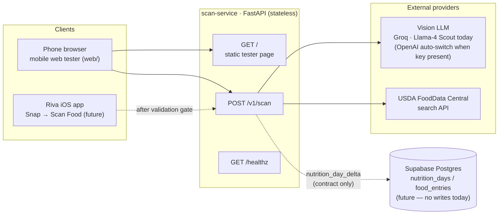
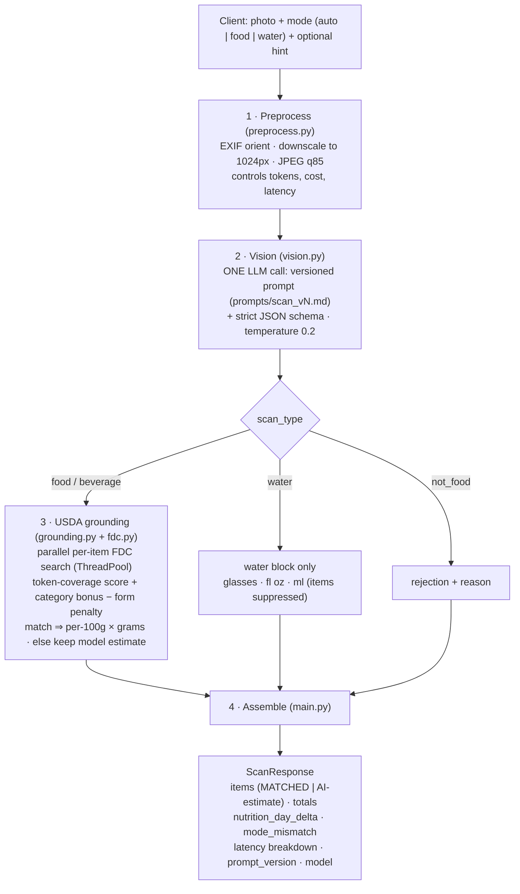
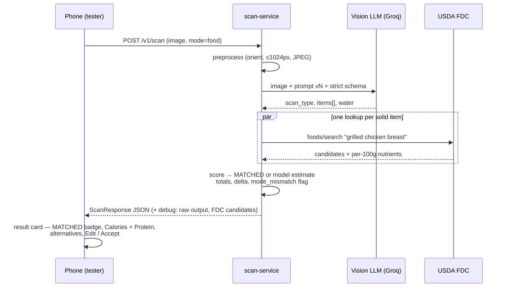
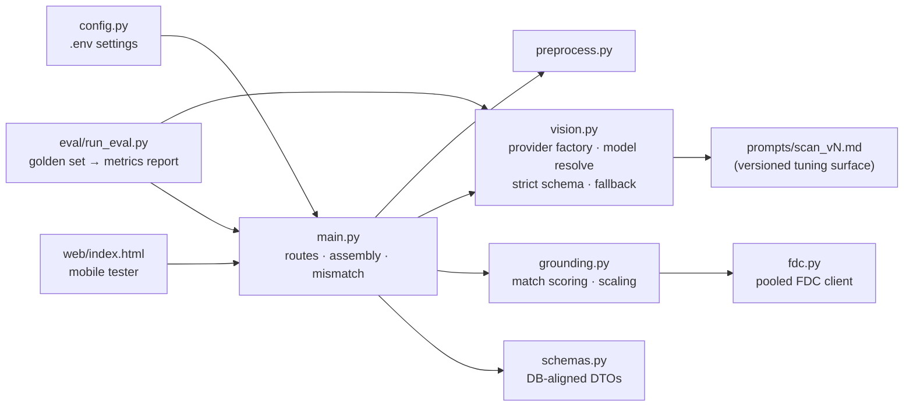

# Riva Snap — Architecture

Riva Snap is the food/water scanning model for the Riva GLP-1 companion app:
one photo in → dish, plate-aware portion, calories, and nutrients out —
tuned for US foods and grounded in USDA data. It is deliberately a
**stateless pipeline service**: no auth, no database writes, so it can be
validated and tuned in isolation before the iOS integration.

## 1. System context

**Key idea:** the service's *response contract* already mirrors the Riva
database (`nutrition_days` integer columns, water in ounces), but nothing is
persisted. When the model passes its accuracy gate, the backend consumes
`nutrition_day_delta` verbatim — integration becomes plumbing, not redesign.

## 2. Scan pipeline

### Stage notes

1. **Preprocess** — phones send 12–48MP HEICs; 1024px JPEG keeps the vision
   call at roughly a cent and 2–5s without hurting recognition.
2. **Vision** — the model's real jobs are *identification* and *portion
   estimation* (plate/container size is prompted as the calibration cue,
   with US serving conventions). Nutrition numbers from the model are only a
   fallback. Structured Outputs guarantee parseable JSON; a `json_object`
   retry covers providers that reject strict schemas.
3. **Grounding** — the accuracy backbone. Matched items get canonical USDA
   per-100g values scaled by estimated grams (the **MATCHED** badge);
   scoring guards learned from live testing: penalize wrong forms
   (flour/dry/babyfood — never "raw", which is correct for produce) and
   boost candidates whose leading word is the food category ("Oranges, raw"
   over "Sherbet, orange"). Lookups run in parallel; FDC failures degrade to
   model estimates, never to scan failures.
4. **Assemble** — integer-rounds to the DB's units and computes
   `nutrition_day_delta`, the exact increment set for the app's daily
   `nutrition_days` upsert. Product rule: only plain water fills
   `water_ounces`; beverages contribute calories/macros instead.

## 3. A scan, end to end

## 4. Modes and the mismatch edge case

The mode selector (**Auto / Food / Water**) is a *lens, never a filter*:

- The vision model is never told to force an interpretation — steering the
  model with "the user intends to log food" made it fabricate a full meal
  from a photo of a water glass (verified live). Food mode therefore adds
  **zero** perception bias; water mode only asks for extra volume care.
- The server compares the *detected* `scan_type` against the requested mode
  and sets `mode_mismatch`; the client shows a "Heads up" banner but renders
  the true content.
- **Accept always logs reality**: a burger scanned in Water mode logs as
  food calories, never as water ounces — and vice versa. A beverage under
  Water mode is also a mismatch (only plain water counts toward hydration,
  matching `nutrition_goals.water_goal` semantics).

## 5. Module map

## 6. Tuning surfaces & how quality is measured

Every knob that affects accuracy is explicit and attributable per scan:

| Surface | Where | Measured by |
|---|---|---|
| Prompt | `prompts/scan_vN.md` (+ `prompt_version` in every response) | eval report deltas |
| Vision model | `RIVA_SCAN_MODEL` env / provider preference lists | eval report deltas |
| Match threshold, form penalties, category bonus | `grounding.py` constants | FDC match rate + kcal MAPE |
| Portion calibration cues | prompt rules (plate size, US portions, ice displacement) | kcal/grams error |

`eval/run_eval.py` batch-runs the pipeline over `eval/images/` +
`golden.jsonl` and reports dish-name match rate, calorie MAPE, scan_type
accuracy, FDC match rate, and latency p50/p95. Acceptance gate for iOS
integration: **≥80% name match · ≤25% kcal MAPE · ≥95% scan_type accuracy ·
≥60% FDC match · p95 ≤6s.**

## 7. Design principles

- **Stateless now, DB-shaped always** — no persistence until the bridge-
  program schema settles; the DTO already speaks the schema's language.
- **Model-agnostic via one SDK** — Groq and OpenAI share the OpenAI SDK and
  Chat Completions surface; provider choice is just which key exists.
- **Grounded numbers beat clever numbers** — the LLM identifies and
  measures; USDA prices the nutrients wherever possible, and the UI is
  honest about which path produced each item (MATCHED vs AI ESTIMATE).
- **Fail soft** — FDC outages, schema rejections, and unreadable images all
  degrade to a usable answer or a clear 4xx/5xx, never a silent wrong log.
- **Everything observable** — per-stage latency, per-candidate FDC scores,
  raw model output behind a debug flag; tuning is evidence-driven.
