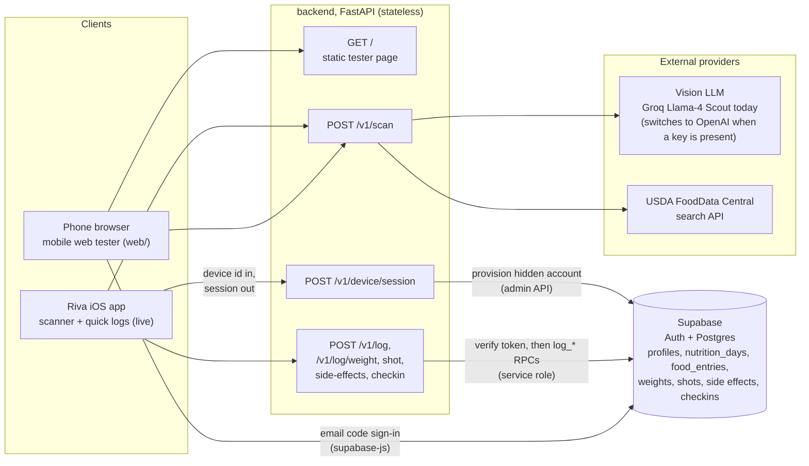
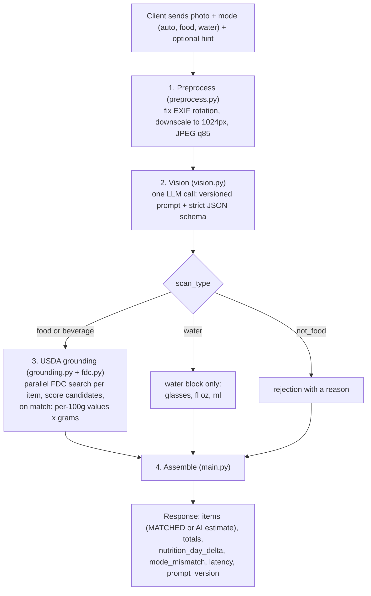
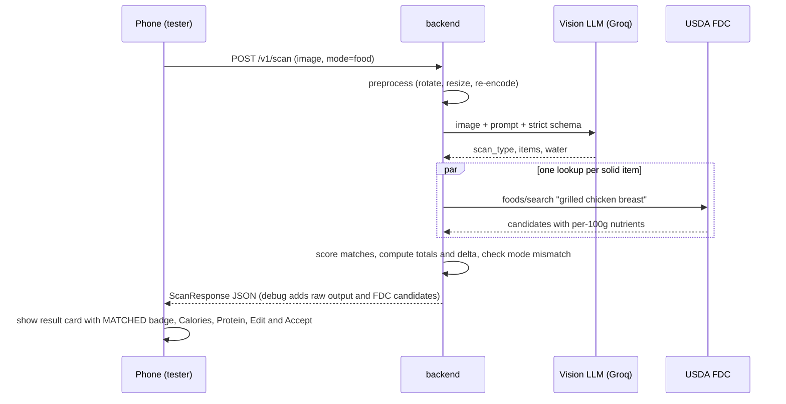
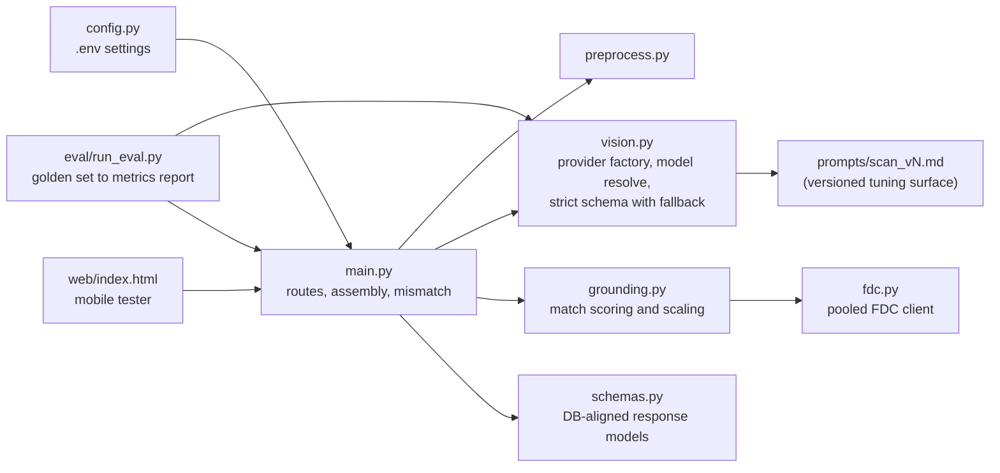

# Riva Snap Architecture

Riva Snap is my backend for the Riva GLP-1 companion app. Its centerpiece is the food and water scanner: you take one photo, and it tells you the dish, the portion size based on the plate, the calories, and the nutrients, tuned for US foods and grounded in USDA data. Around the scanner it carries the logging APIs for the rest of the app: weight, shots, protein, side effects, and sleep.

The scan pipeline itself is stateless. Persistence lives in Supabase: accepting a scan writes a per-meal history row plus the daily totals to Postgres, and every quick log goes through its own server-side function. Identity today is a silent per-device account the iOS app provisions over `/v1/device/session`; the web tester uses an email code.

## 1. System context

Two ideas matter here. First, the scan response's `nutrition_day_delta` block matches the `nutrition_days` table exactly (integer calories, protein, carbs, fiber, and water in ounces), so persistence is a pass-through, not a translation. Second, writes are server-authoritative: the client only authenticates. The service verifies the user's token with Supabase Auth, then calls the `log_scan` Postgres function with the service role key. That function computes the user's local calendar day from their profile timezone, inserts a `food_entries` history row, and increments the day's `nutrition_days` totals in one transaction. Row Level Security keeps every user's data isolated, and clients have no write path of their own.

When the Supabase env vars are absent the service falls back to its original open, stateless mode, which keeps local development and the eval harness working without a database.

## 2. Scan pipeline

What each stage does and why:

1. **Preprocess.** Phones send huge photos. Fixing the rotation and downscaling to 1024px keeps each scan at roughly one cent and a few seconds, without hurting recognition.
2. **Vision.** The model has two real jobs: name the foods and estimate the portions. The prompt tells it to use the plate or container size as a measuring reference and to assume US serving sizes. It also outputs nutrition numbers, but those are only a fallback. Structured output mode guarantees parseable JSON, and there is a retry path for providers that reject strict schemas.
3. **Grounding.** This is where accuracy comes from. For each solid food item, the service searches USDA FoodData Central and scores the candidates. A match means the nutrients are recomputed from lab-measured per-100g values times the estimated grams. That is what the MATCHED badge means. The scoring has guards I learned from live testing: it penalizes wrong food forms like flour, dry, or babyfood (but not "raw", which is the correct form for fresh produce), and it prefers entries whose first word is the food itself, so "Oranges, raw" beats "Sherbet, orange". Lookups run in parallel. If USDA is down, the scan still works with model estimates.
4. **Assemble.** Rounds everything to the database units, adds up totals, computes the delta, and flags a mode mismatch if the photo does not match what the user chose to log. One product rule lives here: only plain water fills `water_ounces`. A latte counts as calories, not hydration.

## 3. A scan, end to end

## 4. Modes and the mismatch edge case

The mode selector (Auto, Food, Water) is a hint about intent. It never forces an interpretation.

I learned this the hard way. When the prompt told the model "the user intends to log food", it invented an entire chicken and rice dinner from a photo of a water glass. So now:

- Food mode adds no bias to what the model sees. Water mode only asks it to pay extra attention to container volume.
- The server compares what was actually detected against the mode the user picked, and sets `mode_mismatch` when they disagree. The tester shows a "Heads up" banner but renders the real content.
- Accept always logs reality. A burger scanned in Water mode logs as food calories, never as water ounces, and the reverse is also true. A beverage in Water mode also counts as a mismatch, because only plain water counts toward the hydration goal.

## 5. Module map

## 6. Tuning surfaces and how quality is measured

Every knob that affects accuracy is explicit, and every scan reports which prompt version and model produced it, so improvements are attributable.

| Surface | Where | Measured by |
|---|---|---|
| Prompt | `prompts/scan_vN.md`, version echoed in every response | eval report deltas |
| Vision model | `RIVA_SCAN_MODEL` env var, or the provider preference list | eval report deltas |
| Match threshold, form penalties, category bonus | constants in `grounding.py` | FDC match rate, calorie error |
| Portion calibration cues | prompt rules (plate size, US portions, ice displacement) | grams and calorie error |

`eval/run_eval.py` runs the pipeline over the photos in `eval/images/` against the labels in `golden.jsonl` and reports dish-name match rate, calorie error (MAPE), scan-type accuracy, USDA match rate, and latency percentiles.

The acceptance gate for iOS integration: at least 80% name match, at most 25% calorie MAPE, at least 95% scan-type accuracy, at least 60% USDA match rate, and p95 latency under 6 seconds.

## 7. Design principles

- **Stateless pipeline, database-shaped contract.** The scan itself stores nothing, and its response already speaks the schema's language, so persistence is a single pass-through call to `log_scan`.
- **One SDK, two providers.** Groq and OpenAI both work through the OpenAI SDK and the same Chat Completions call. The provider is decided by which key exists in `.env`.
- **Grounded numbers beat clever numbers.** The LLM identifies and measures. USDA prices the nutrients whenever a match exists, and the UI is honest about which path produced each item.
- **Fail soft.** A USDA outage, a rejected schema, or an unreadable image degrades to a usable answer or a clear error. It never becomes a silently wrong log.
- **Everything observable.** Per-stage latency, per-candidate match scores, and raw model output behind a debug flag. Tuning decisions are made from evidence, not vibes.
